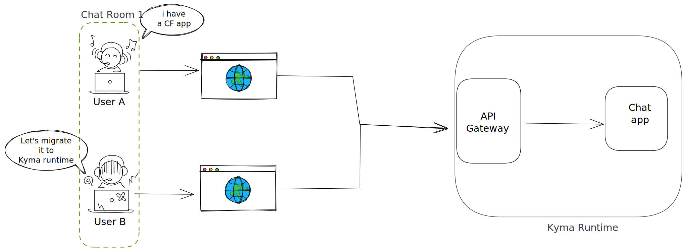

# Node-chat-sample

## Description

This is a simple chat application that is built on NodeJS. It uses socket.io library which enables real-time, event-based communication. It shows how socket.io rooms can be used to create different chat rooms.
This application can be run locally as well as on Cloud Foundry landscape.  

Features:

- Login with name, email Id.
- Chat with a user who has logged into the same chat room. 
- Only 2 people are allowed per room. If more people enter, they will be directed to a different room.

It is based on [SAP Sample for Cloud Foundry](https://github.com/SAP-samples/cloud-sample-node-chat) and will be deployed on the Kyma runtime.

## Prerequisites

- SAP BTP, Kyma runtime instance([You can use a Trial account](https://blogs.sap.com/2020/10/09/kyma-runtime-available-in-trial-and-now-we-are-complete/))
- [Docker](https://www.docker.com/)
- `docker login`. This will be required for pushing the docker image to the registry.
- [make](https://www.gnu.org/software/make/)
- [kubectl](https://kubernetes.io/docs/tasks/tools/install-kubectl/)

## Steps

### Building the artifact

- Clone the repository <https://github.com/abbi-gaurav/cloud-sample-node-chat>

- `cd cloud-sample-node-chat`

- `export DOCKER_ACCOUNT={provide-your-docker-account}`

- Build the docker image (application artifact)

  `make build-image`
  The docker image is your binary artifact that will be used for deploying the application on Kyma / Unified runtime. This is one major difference from Cloud Foundry where it was not required to create and store such artifacts.

- Run the image locally (Optional)

  `make run-local`

  Access the chat app at <http://localhost:8089>

- Push the image

  `make push-image`
  The image is pushed to a docker registry which is available over the internet. For Public registries such as Docker Hub, anyone can download the docker image and use it. In case, it is required to not make the image publicly available, private registries can be used.

### Deploying to Kyma runtime

- Download kubeconfig from the Kyma console.
    
  - The kubeconfig file contains details about the kubernetes server as well as the credentials.
  - The chat application will be deployed to this Kubernetes Cluster.
  - Feel free to check out the contents of the kubeconfig file

- Instruct your kubectl to point to the Kubernetes cluster
  `export KUBECONFIG=<path-to-kubeconfig>`
  
  This together with the previous steps are similiar to doing `cf login`

- Create the deployment. Update the image in [deployment.yaml](kubernetes/deployment.yml)
  
  

  `kubectl apply -f kubernetes/deployment.yml`

  This is similiar to doing a `cf push`.
  The deployment is a specification to the Kubernetes about an application you want to run. It includes details about the artifact (docker image), how many replicas, port on which app will be running among others.
  Kubernetes will pull the artifact (**Docker Image**) and deploy the application.

- Create the routing and expose it over internet

  `kubectl apply -f kubernetes/routing.yml`

  This is similiar to creating routes in Cloud Foundry.
  Here we create two Kubernetes resources
  1. A Kubernetes Service that exposes the application pods as a network service with a consistent DNS name and IP inside the Kubernetes Clustrer.
  2. An API Rule which is Kyma way of exposing a internal Kubernetes Service over the internet.

### Try it out

The chat app can be acccessed at <https://cloud-sample-node-chat-demo-app.{cluster-domain}>

or access it via the Kyma console UI

